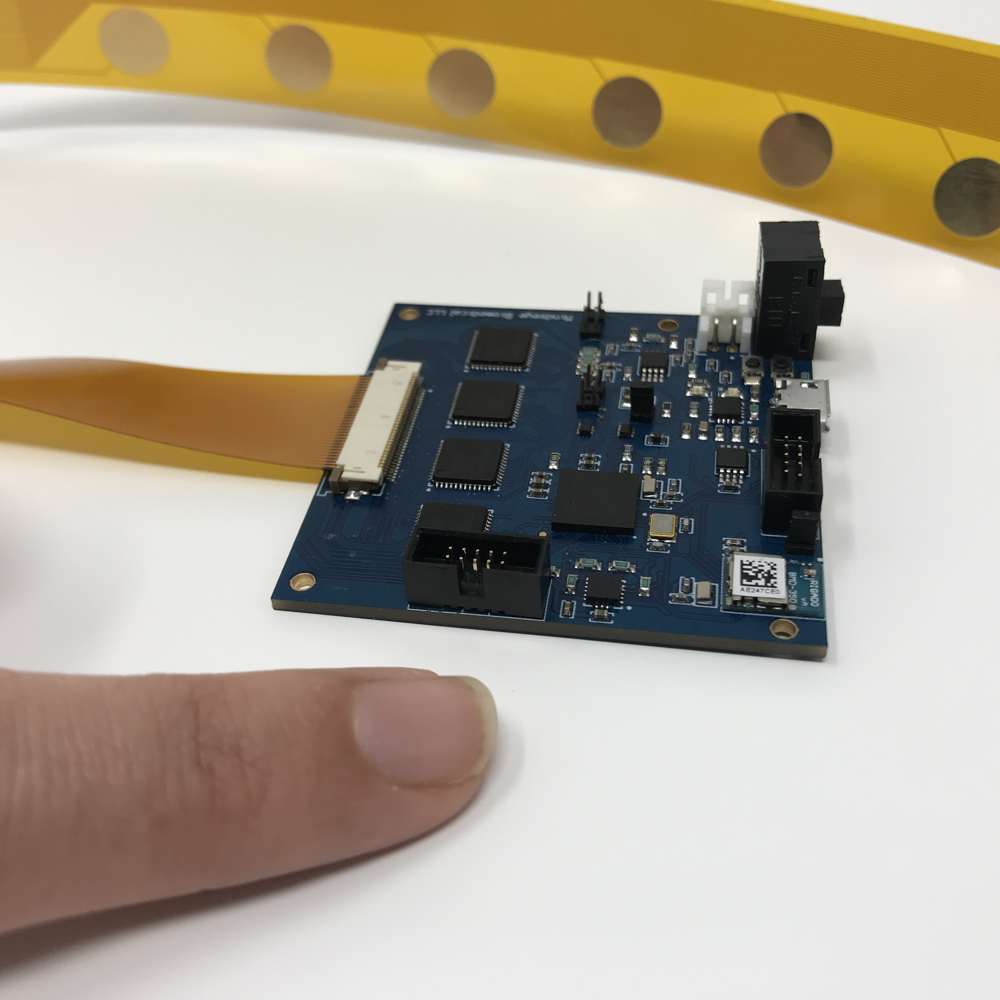
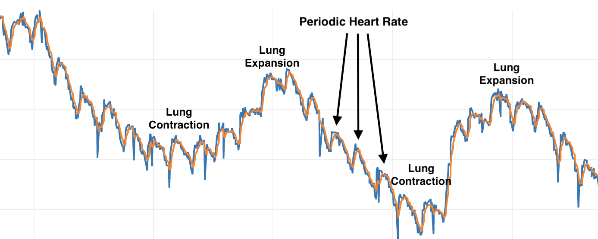
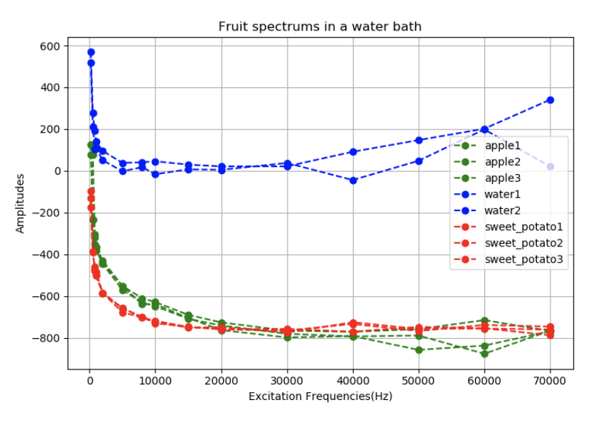
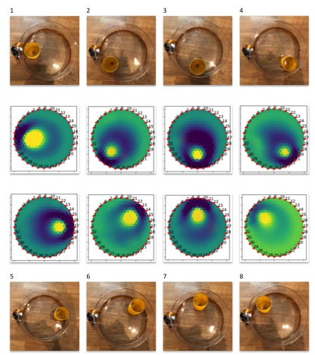
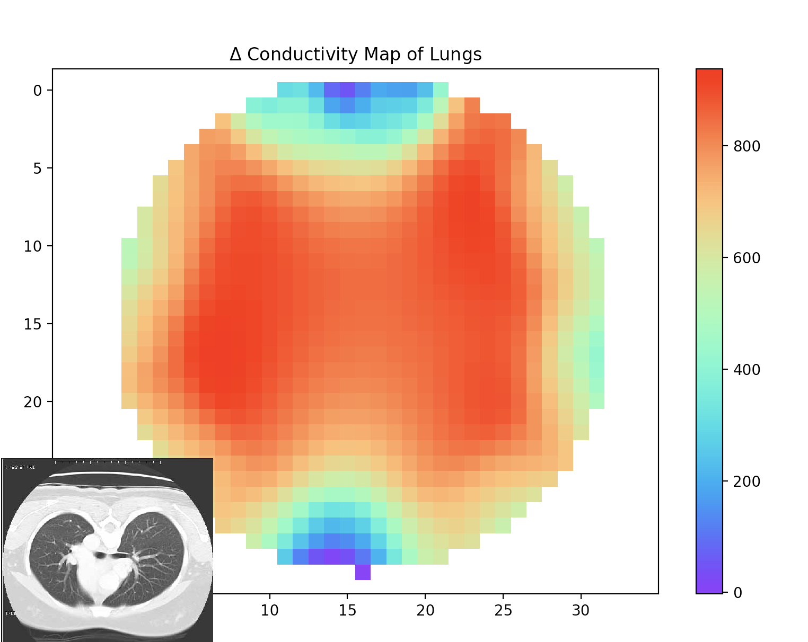

# Intro

* Note: Installation of GCC firmware development environment is here (https://github.com/dioptre/ADuCM350). 

This software has been used and tested on:
* Linux (Debian Buster, Fedora 28)
* Segger EDU SWD

## Build and Install
* Build using the the "Release" configuration and use "upload.sh" to upload it to your device. This version can not be debugged (the Debug configuration can).

## Details of the function and operation of the firmware. 
Wondering how the impedance measures are made? Want to get phase and magnitude out and play with that? Want to try different electrode stimulation patterns? You're in the right place.

# Hardware 
This firmware is meant for the Spectra: 32 electrode EIT device, which is also capable of bio-impedance spectroscopy as time series impedance measurements.
 


# Running the installed firmware. 

The device comes pre-programmed with this firmware. Each time you reset the device a set of menu options is communicated via UART. Once you select an option, press the return key and that option will start executing until you power cycle once more. 

Options Outlines: 
A) Time series - 
   This outputs the impedance magnitude at 40 frames per second at 50kHz(or whatever frequency is set in firmware). 

   How to take a measurement with bioimpedance spectroscopy: A+, V+, V- ,A-

   Example of Use: 


B) Bioimpedance Spectroscopy - 
	This outputs impedance magnitudes at the following frequencies, and then repeats the cycle. 
	frequencies = {200,500,800,1000,2000,5000,8000,10000,15000,20000,30000,40000,50000,60000,70000};

	Example of use: 



C) Electrical Impedance Tomography - This is configurable in firmware to 8, 16, 32 electrodes dependent on desired timing and resolution trade offs etc. 

The ordering of electrodes is created using pyEIT as follows: 
ex_mat = eit_scan_lines(ne=8, dist=3)  step = 3
ex_mat = eit_scan_lines(ne=16, dist=8) step = 8
ex_mat = eit_scan_lines(ne=32, dist=16) step = 16
In the file the ordering is:
A+, A-, V+, V-
A, B, M, N
where
    A : current driving electrode
    B : current sink
    M, N : boundary electrodes, where v_diff = v_n - v_m

We have chosen an opposition based electrode patten instead of the more commonly used adjacent scheme, as we came across these papers supporting improved contrast if opposition schemes were used: 
[1]	A. Adler, P. O. Gaggero, and Y. Maimaitijiang, “Adjacent stimulation and measurement patterns considered harmful,” Physiol. Meas., vol. 32, no. 7, pp. 731–744, 2011.
[2]	F. M. Yu, C. N. Huang, F. M. Hsu, and H. Y. Chung, “Pseudo electrodes driven patterns for Electrical Impedance Tomography,” Proc. SICE Annu. Conf., pp. 2890–2894, 2007.

It's possible other electrode arrangement schemes are better yet. 

	Example of use: 





A note on which debugger to use: 
- I recommend using a Segger J-link debugger with SWD programming cable. If you are not using it for commercial use you can get the EDU version at a reasonable price(you don't even have to be part of a school). The configuration on the PCB also allows for the VCOM port to work which means you can also read serial through the same connection. The specific configuration can be seen in the .bat file contained in the EXE directory. 


## Contributions

* Create your own branch and push to here, then to do a pull request (https://help.github.com/articles/about-pull-requests/)
```
git checkout -b mybranch
git add -A :/
git commit -am "my branch is great"
git push origin mybranch
#then merge mybranch into our github repo using a pull request (above)
```
* Look for comments with AG or MVB for things that might be broken or missing. There was a duplicate interrupt in FLASH and CRC that was removed in CRC (find **ADI_INT_HANDLER(DMA_CRC_Int_Handler)**). Everything else should be working.

## Contributors

* Jean Rintoul
* Moritz von Buttlar
* Andrew Grosser

## License

There are multiple licenses in the /LICENSES folder. Please understand and accept all of them. Of note:
* The main executable file (OpenEIT.c) is licensed in part under the Creative Commons Attribution-NonCommercial-ShareAlike 4.0 International Public License.
* Otherwise where not specifically stated, this repository and all source code is licensed under the Apache License v2 (https://www.apache.org/licenses/LICENSE-2.0.html). Any contributions submitted to this project fall under the Apache License.
* I'd like to thank Analog Devices for their permission to use and redistribute the original software (See /LICENSES/ADI.LABLAB.LICENSE) taken from their ADUCM350 SDK (http://www.analog.com/en/products/aducm350.html). Please assume we've modified the original versions.
* Other licenses may have been used to develop and source this software. Please see /LICENSES for more information and find specific license information for files in some of the headers. 


## Help I bricked my chip
* Use the CM3WSD software that comes with the EVAL SDK (link above) board to erase it. Might need a friend with a Windows box to do this.
